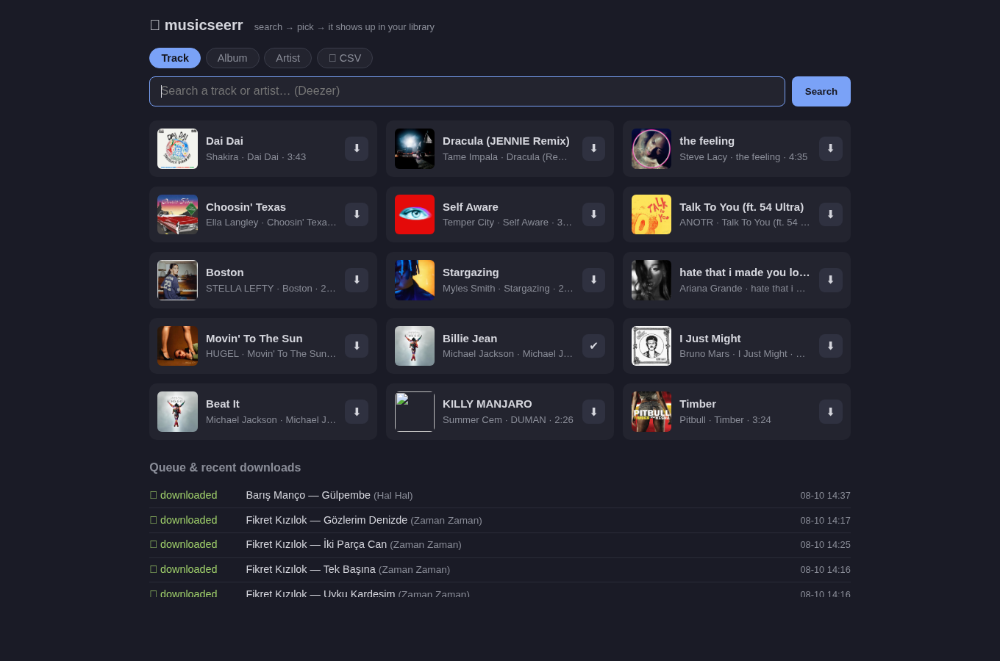

# 🎵 musicseerr

**A Jellyseerr-style request app — for music.** Search a track, album or artist,
click download, and moments later it appears in your Navidrome / Jellyfin
library: fetched from YouTube, tagged with real metadata from Deezer, and filed
into a clean folder layout. No indexers, no torrents, no *arr stack.



## Why this exists

Jellyseerr/Overseerr solved discovery for movies and TV, but music selfhosters
are stuck between heavyweight automation (Lidarr + indexers) and manual
`yt-dlp` + tag editing. musicseerr is the middle path: a small web app where
**picking a song is the whole workflow**. Everything else — source selection,
downloading, tagging, cover art, folder layout, library pickup — is automatic.

## Features

- **🔍 Search tracks, albums and artists** — metadata and cover art come from
  the Deezer API (free, no API key required).
- **⬇ One-click downloads** — the audio is found on YouTube by duration
  proximity, preferring official auto-generated *"Topic"* channels over remixes
  and live versions.
- **💿 Bulk downloads** — grab a whole album, an artist's top 25, or their
  entire discography (with a confirmation prompt — that can be hundreds of
  tracks).
- **📄 CSV import** — drop in an [Exportify](https://exportify.net) export of a
  Spotify playlist, an iTunes export, Google Takeout's
  `music-library-songs.csv`, or a plain `artist,title` list. Every row is
  matched against Deezer and shown as a preview; **nothing downloads until you
  confirm**. Unmatched rows are listed so you can search them manually.
- **🏷 Proper tagging** (the part most pipelines get wrong):
  - ID3v2.3: title, artists (incl. features), album, track/disc number, year,
    genre, embedded 500px cover art
  - **`album_artist` is set to the *album's* artist** (fetched separately from
    Deezer) — this is what Navidrome and Jellyfin actually group artists by,
    and it is the difference between a clean library and a mess of
    "Artist, Feat. X" phantom entries
  - the source YouTube URL is kept in `TXXX:purl` for traceability
- **📂 Library-friendly layout** — `Music/<album artist>/<album>/<artist> - <title>.mp3`.
  Navidrome's file watcher picks new files up within a minute; no rescan needed.
- **🚦 Sequential queue, built for small servers** — one download at a time
  (runs happily on a Raspberry Pi 4 next to a dozen other containers), with a
  slightly randomized gap between downloads.
- **🔁 Resilient** — transient YouTube 403s get one automatic retry; permanent
  failures get a retry button. Duplicates are skipped: files already in your
  library are never re-downloaded. The queue survives restarts.

## Quick start

```bash
git clone https://github.com/benginN/musicseerr.git
cd musicseerr
# edit docker-compose.yml: set the /music volume to your library root
docker compose up -d --build
```

Open `http://your-server:8086` — that's it.

> **Build note:** the image is built locally (Python 3.12 slim + ffmpeg,
> ~400 MB). Works on amd64 and arm64 (developed on a Raspberry Pi 4).

## Configuration

Everything is optional; defaults work out of the box.

| Env variable | Default | What it does |
|---|---|---|
| `MUSIC_DIR` | `/music` | Library root inside the container (mount your library here) |
| `DATA_DIR` | `/data` | State dir: queue database + temp downloads |
| `AUDIO_FORMAT` | `mp3` | Output format passed to yt-dlp/ffmpeg |
| `AUDIO_QUALITY` | `0` | yt-dlp audio quality (0 = best) |
| `COOKIES_FILE` | *(unset)* | Path to a Netscape-format cookies file, only needed if YouTube bot-checks your server (see below) |
| `TZ` | — | Timezone for queue timestamps |

Also set `user:` in `docker-compose.yml` to the uid:gid that owns your music
folder, so new files get the right ownership.

### Media server notes

- **Navidrome**: point musicseerr at the same folder Navidrome scans and
  you're done — the file watcher notices new files on its own. Mount the
  library read-write here and read-only in Navidrome if you like the
  principle of least privilege (musicseerr is the only writer).
- **Jellyfin**: same layout works; Jellyfin treats each album folder as an
  album. Trigger a library scan or enable real-time monitoring.

## API

The UI is a thin layer over a JSON API — automate away:

| Endpoint | What it does |
|---|---|
| `GET /api/search?q=` · `/api/search-album?q=` · `/api/search-artist?q=` | Search Deezer |
| `GET /api/artist/{id}` | Artist page: top tracks + discography |
| `POST /api/download` `{deezer_id}` | Queue one track |
| `POST /api/download-album` `{album_id}` | Queue a whole album |
| `POST /api/download-artist` `{artist_id, mode: "top"\|"albums"}` | Queue an artist |
| `POST /api/csv-match` `{csv}` | Match CSV rows against Deezer (preview only) |
| `POST /api/download-list` `{tracks: [...]}` | Queue a confirmed list |
| `GET /api/queue` · `GET /api/job/{id}` · `POST /api/retry/{id}` | Queue state |
| `GET /api/health` | Health check (for monitoring) |

## Troubleshooting

- **Downloads suddenly fail (`Unable to extract ...`)** — yt-dlp is outdated;
  YouTube changes constantly. Rebuild the image, which pulls the latest yt-dlp:
  `docker compose build --no-cache && docker compose up -d`
- **A single track fails with `403 Forbidden`** — a transient YouTube hiccup.
  It's retried once automatically; if it still fails, hit 🔁 in the queue.
  Only worry when *every* download 403s (then see the cookies note).
- **`Sign in to confirm you're not a bot`** — YouTube is bot-checking your IP.
  Export cookies from a logged-in browser session (any "get cookies.txt"
  extension) and set `COOKIES_FILE`.
- **Tracks appear under a wrong artist in Navidrome** — should not happen for
  musicseerr-downloaded files (that's the whole `album_artist` point); for
  files from elsewhere, fix their `album_artist` tag.

## What it deliberately doesn't do

- No torrents, no usenet, no indexers — nothing is uploaded or seeded, ever.
- No transcoding, no library management, no duplicate of what Navidrome does.
- No accounts/auth: it is meant to live on a LAN or behind your own reverse
  proxy / VPN. **Do not expose it to the open internet as-is.**

## Legal

For personal use. Downloading from YouTube may violate YouTube's Terms of
Service and, depending on your jurisdiction, copyright law. This tool exists
to automate a workflow you could do by hand with yt-dlp; you are responsible
for how you use it. It circumvents no DRM and never uploads or redistributes
anything.

## Status

A hobby project, built for my own homelab and shared as-is. Issues and PRs are
welcome, but there is **no support guarantee** — maintenance happens when life
allows. ([Türkçe not: bu proje ev sunucum için yazıldı; sorular için issue
açabilirsiniz.])

## Credits

This project was built **entirely with [Claude](https://claude.com/claude-code)**
(Anthropic's Claude Code). The design, every line of code, the tests, the
deployment and this README came out of pair-programming sessions between me and
Claude on the Raspberry Pi this app was born on — from "could we build a
Jellyseerr for music?" to this public release, including the end-to-end testing
against a real Navidrome library. Claude is credited as co-author in the
commit history.

## License

[MIT](LICENSE)
